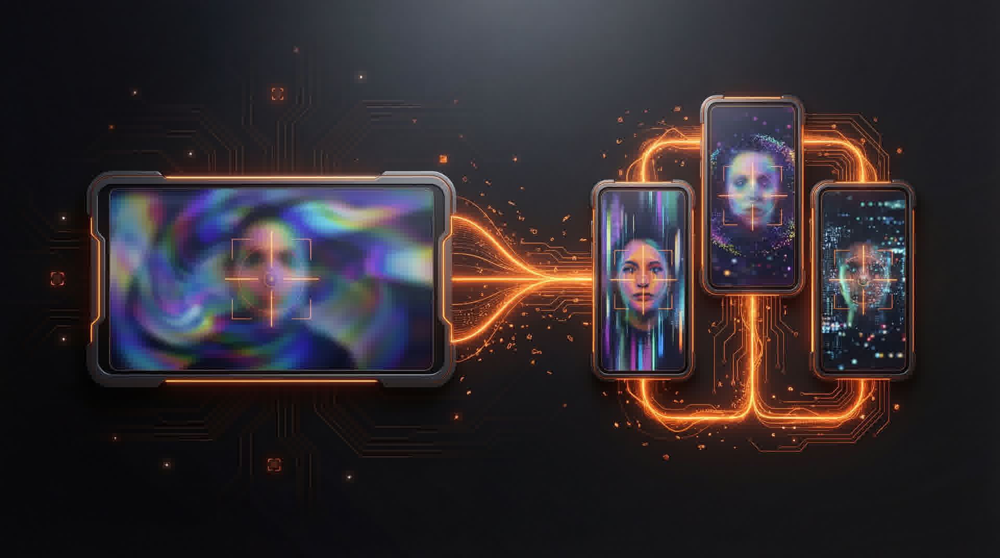

<p align="center">
  
</p>

<p align="center">
  
</p>

<h1 align="center">IX Clip Extractor Pipeline</h1>

<p align="center">
  Turn any long-form video into polished, platform-ready short-form clips.<br/>
  Face-tracking reframe, AI-powered clip selection, Remotion editing, and multi-platform distribution.
</p>

<p align="center">
  
  
  
  
  
</p>

<p align="center">
  <a href="https://getlate.dev?atp=enriquemarq"></a>
</p>

---

## What This Does

```
Long-form video (16:9)
  → Clip Selection (transcript analysis, 5-category scoring)
  → Face-Tracking Extraction (MediaPipe, EMA smoothing, auto-layout detection)
  → Transcription (WhisperX GPU, word-level timestamps)
  → Remotion Editing (illustrations, SFX, captions, motion graphics)
  → Multi-Platform Distribution (YouTube, Instagram, TikTok, and more)
```

## Quickstart

### 1. Install dependencies

```bash
# Node.js (Remotion)
npm install

# Python (Clip Extractor)
cd tools && pip install -r clip_extractor/requirements.txt
```

### 2. Extract and reframe a clip

```bash
cd tools
python -m clip_extractor reframe \
  --video "../public/videos/your-video.mp4" \
  --output "../public/videos/clips/clip-01/" \
  --format 9x16
```

### 3. Preview in Remotion Studio

```bash
npm run studio
```

## Requirements

- **Node.js 18+** — Remotion video engine
- **Python 3.10+** — Clip extractor and face tracking
- **FFmpeg** — Must be on PATH
- **NVIDIA GPU** — Optional but recommended (5-10x faster with NVENC)

## Architecture

### Python Clip Extractor (`tools/clip_extractor/`)

Local pipeline that transforms 16:9 landscape videos into 9:16 portrait clips with intelligent face-tracking crop.

**4 layout modes (auto-detected):**

| Mode | Trigger | Use Case |
|------|---------|----------|
| 9x16 face-track | Face detection >= 15% | Talking head, vlog |
| 1x1 face-track | `--format 1x1` | Instagram feed, LinkedIn |
| Split: multi-face | `--format split` | Zoom calls, interviews |
| Split: screen-share | Auto (face < 15%) | Tutorials, screen recordings |

**Pipeline stages:**
1. Face Detection (MediaPipe BlazeFace)
2. Temporal Smoothing (EMA/Kalman filter)
3. Deadzone Filtering (suppress micro-movements)
4. Layout Auto-Detection (talking head vs screen-share)
5. Crop Path Generation (inspectable JSON intermediate)
6. GPU-Accelerated Rendering (NVENC or libx264)

**Key commands:**

```bash
# Full pipeline (most common)
python -m clip_extractor reframe --video input.mp4 --output clips/ --format 9x16

# Analyze only (inspect crop_path.json before rendering)
python -m clip_extractor analyze --video clip.mp4 --output crop_path.json

# Render from edited crop_path.json
python -m clip_extractor render --video clip.mp4 --crop-path crop_path.json --output out.mp4

# Batch mode (multiple clips)
python -m clip_extractor batch --video source.mp4 --clips definitions.json --output clips/
```

**Configuration:** All parameters tunable in `tools/clip_extractor/config.yaml` — no code changes needed.

### Clip Selection Engine

Transcript-based clip selection with 5-category scoring:

- **Hook Strength** (0-20): First 3 seconds grab attention?
- **Value Delivery** (0-20): Teaches something actionable?
- **Clarity** (0-20): Single clear message?
- **Shareability** (0-20): Would someone share/save this?
- **Completeness** (0-20): Starts and ends naturally?

Use the `/clip-selection` skill in Claude Code to analyze transcripts and select the best moments automatically.

### Remotion Video Editing (`remotion/`)

Programmatic video composition with pop-out overlays, illustrations, SFX, and word-level captions.

**Core components:**
- `ConceptOverlay` — Full-screen white-bg illustration reveal (primary for pipeline clips)
- `AppleStylePopup` — Premium white popup with spring animation (standalone demos + announcements)
- `FloatingCard` — Branded card overlay (speaker remains visible)
- `PlatformCascade` — Progressive platform logo reveal
- `KineticText` — Per-character spring animation
- `PhraseCaption` / `WordByWordCaption` — Caption systems

**22 compositions included** — 5 gold standards to study, plus 17 real-world examples across pipeline clips, podcast edits, and standalone motion graphics.

| Composition | Type | Description |
|-------------|------|-------------|
| `Clip1FromZeroTo90K` | Pipeline clip | Partner success story (76s, 9 pop-outs) |
| `Clip2StopManuallyPosting` | Pipeline clip | Voice prompt demo (78s, 14+ pop-outs) |
| `Clip6VoiceControlDemoV3` | Standalone demo | Tier system with AppleStylePopup (70s) |
| `ClaudeOpus46Announcement` | Announcement | Full-screen talking head (130s, 18 pop-outs) |
| `CraftingOutreachCampaign` | Long-form | Screen-share tutorial (28 min, 35+ pop-outs) |
| `PodcastStressExpert` | Podcast | Layout-aware captions, split-screen (120s) |
| `ToolCalling2Point0` | Motion graphics | Standalone animated piece (30s, no source video) |
| *+ 15 more pipeline clips* | Various | Claude Creatives batch 1 & 2, content clips |

**60 reusable illustration components** in `remotion/lib/illustrations/` — all SVG with built-in motion.

### Claude Code Skills (`.claude/skills/`)

13 integrated skills that orchestrate the full pipeline:

| Skill | Command | What It Does |
|-------|---------|-------------|
| clip-extractor | `/clip-extractor` | Invoke the Python face-tracking tool |
| clip-selection | `/clip-selection` | Analyze transcripts, score and select clips |
| edit | `/edit` | Entry point — routes to editing sub-skill |
| video-editing | (router) | Shared component library, rules, SFX hierarchy |
| short-form-editing | (sub-skill) | <90s editing process (7 phases) |
| long-form-editing | (sub-skill) | 5+ min editing process |
| visual-overlay-creation | `/visual-overlay` | Create individual illustrations |
| extracting-transcripts | `/transcribe` | WhisperX GPU transcription |
| short-form-posting | `/post-short` | Multi-platform publishing |
| youtube-content-package | `/youtube-package` | Full YouTube package (title, tags, description, thumbnail) |
| video-upload-helper | `/upload-video` | Compress + upload to storage |
| late-social-media | `/post-to` | Post to 13+ platforms via [Late](https://getlate.dev?atp=enriquemarq) |
| content-analytics | `/analytics` | Track post performance |

## Full Pipeline Walkthrough

### Step 1: Place your source video

```bash
mkdir -p public/videos/my-project
cp /path/to/your-long-form-video.mp4 public/videos/my-project/source.mp4
```

### Step 2: Transcribe

```bash
# Using WhisperX (local GPU — recommended)
whisperx public/videos/my-project/source.mp4 \
  --model large-v3 --device cuda --compute_type float16 \
  --output_dir public/videos/my-project/ --output_format srt
```

### Step 3: Select clips

Use Claude Code with the `/clip-selection` skill:
```
/clip-selection public/videos/my-project/source.srt
```

This outputs `clip_definitions.json` with scored selections.

### Step 4: Batch extract

```bash
cd tools
python -m clip_extractor batch \
  --video "../public/videos/my-project/source.mp4" \
  --clips "../public/videos/my-project/clip_definitions.json" \
  --output "../public/videos/my-project/clips/"
```

### Step 5: Generate word data for each clip

For each extracted clip, transcribe to get word-level timestamps:
```bash
python remotion/data/convert-srt-to-words.py \
  public/videos/my-project/clips/clip-01/source.srt \
  --output remotion/data/my-clip-01-words.ts
```

### Step 6: Edit with Remotion

Use Claude Code:
```
/edit public/videos/my-project/clips/clip-01/reframed-9x16.mp4
```

This creates a polished Remotion composition with illustrations, SFX, and captions.

### Step 7: Render

```bash
npx remotion render remotion/index.ts MyClip01 out/my-clip-01.mp4 --codec h264
```

### Step 8: Distribute with [Late](https://getlate.dev?atp=enriquemarq)

Publish to 13+ platforms at once from a single command:
```
/post-short out/my-clip-01.mp4
```

This generates platform-tailored content packages (different copy, hashtags, and formatting per platform) and publishes to YouTube Shorts, Instagram Reels, TikTok, LinkedIn, X, Threads, Bluesky, and more — all through [Late](https://getlate.dev?atp=enriquemarq)'s unified API.

## Configuration

### Clip Extractor (`tools/clip_extractor/config.yaml`)

| Parameter | Default | Effect |
|-----------|---------|--------|
| `detection.face.min_confidence` | 0.5 | Lower = detect more faces |
| `smoothing.ema.alpha` | 0.12 | Lower = smoother (more lag) |
| `deadzone.threshold_pct` | 0.05 | Lower = more responsive crop |
| `output.crf` | 18 | Lower = higher quality |
| `output.use_nvenc` | auto | GPU acceleration |
| `split_screen.merge_distance` | 0.20 | Face proximity threshold |

### Remotion (`remotion/lib/config.ts`)

- FPS: 30
- Portrait: 1080x1920
- Landscape: 1920x1080
- Square: 1080x1080

### Brand Colors (`remotion/lib/colors.ts`)

- Primary: `#FF6B00` (orange)
- Dark: `#0D0D0D`
- White: `#FFFFFF`

## Editing Rules (from `remotion/playbook/`)

1. **ALWAYS use WORDS data** for frame timing — never estimate
2. **Pop-out at EXACT frame** the keyword is spoken
3. **Illustration-first** — no caption on most pop-outs
4. **illustrationSize:** 800 (no text), 700 (with text), 620 (CTA)
5. **Every illustration unique** — never reuse between concepts
6. **Real logos via `Img` + `staticFile()`** — never recreate as SVG
7. **Long-form: flat 1.0 zoom** — no swimming
8. **Background music:** 0.02 volume, first 35s only
9. **SFX J-cut:** Sound hits 2-3 frames before the visual
10. **SFX variety** — never repeat same sound on consecutive pop-outs

## Directory Structure

```
ix-clip-extractor-pipeline/
├── tools/clip_extractor/     # Python face-tracking extraction engine
├── remotion/
│   ├── components/           # Overlay components (ConceptOverlay, AppleStylePopup, etc.)
│   ├── compositions/         # 22 compositions (5 gold standards + 17 examples)
│   ├── data/                 # Word-level timing data + SRT converter
│   ├── lib/                  # Config, colors, 60 illustration components
│   └── playbook/             # Creative direction rules
├── public/
│   ├── logos/                # 24 platform + brand SVGs
│   └── audio/                # SFX library (pop, whoosh, click, music)
└── .claude/skills/           # 13 Claude Code skill integrations
```

## Content Distribution Partner

<a href="https://getlate.dev?atp=enriquemarq">
  
</a>

This pipeline distributes to **13+ platforms** through [Late](https://getlate.dev?atp=enriquemarq) — a single API call handles platform-specific formatting, scheduling, and publishing across YouTube Shorts, Instagram Reels, TikTok, LinkedIn, X, Threads, Bluesky, Facebook, Pinterest, Snapchat, Reddit, Telegram, and Google Business.

**Why Late:**
- One request, all platforms — no per-platform API integrations to maintain
- Per-platform content customization (different copy, hashtags, aspect ratios)
- Scheduling with timezone support
- Media upload via presigned URLs (no size limits, no third-party hosting)
- Creator-friendly — built for workflows like this pipeline

Get started as a creator: **[getlate.dev](https://getlate.dev?atp=enriquemarq)**

## Built With

- **[Remotion](https://www.remotion.dev/)** — Programmatic video engine
- **[Claude Code](https://claude.ai/claude-code)** — AI-powered editing orchestration
- **[Late](https://getlate.dev?atp=enriquemarq)** — Multi-platform content distribution (13+ platforms)
- **[MediaPipe](https://ai.google.dev/edge/mediapipe/solutions/vision/face_detector)** — Face detection for intelligent reframing
- **[WhisperX](https://github.com/m-bain/whisperX)** — Word-level transcription with GPU acceleration
- **[Nano Banana Pro](https://kie.ai)** — AI image generation (header image, thumbnails)

## Author

**Enrique Marq** — [@enriquemarq-0](https://youtube.com/@enriquemarq-0)

- [YouTube](https://youtube.com/@enriquemarq-0)
- [LinkedIn](https://linkedin.com/in/enrique-marq-756191319/)
- [Instagram](https://instagram.com/kikefuturo_)

## License

Proprietary. See LICENSE file for terms.
